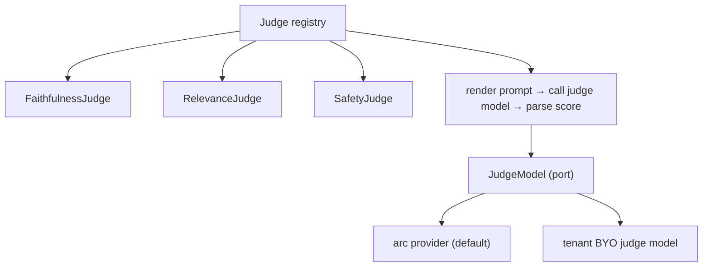

# Service — arc-evaluator

**Role:** measure response quality. **Online** (inline, best-effort) on the hot
path, and **offline** on traces the OTel Collector fans out to it. Both modes
share the same evaluators and write results to the **evaluation database**. The
online/offline split is [ADR-0008](../adr/0008-online-offline-evaluation.md).

For Phase 1: **LLM-as-a-judge only** — no heuristic or deterministic metrics. A
fast judge runs online; heavier judges run offline. Judge models come from the
**arc provider** by default; tenants may bring their own judge models (BYO) to
fit cost, latency and availability.

---

## API

```
POST /v1/evaluate    # score a completed request, inline
GET  /health
```

```jsonc
// request
{ "request": {...}, "response": {...}, "tenant": "acme", "judges": ["faithfulness"] }

// response
{ "scores": { "faithfulness": 0.87 }, "labels": { "faithfulness": "pass" }, "passed": true }
```

---

## Internal design — judge registry + model port



- Each **judge is a pure prompt + parser**: `(request, response) -> Score`; the
  model call is the only I/O, behind a port.
- The **registry** maps a name to a judge; the active set is config-driven.
  Adding a metric = write a prompt + parser, register it.
- **Models are pluggable** via the `JudgeModel` port: arc provider by default,
  tenant BYO model otherwise — see [ADR-0011](../adr/0011-pluggable-models.md).

```
arc_evaluator/
  judges/         # prompt + parser per metric (pure)
  registry.py     # name → judge
  models/         # JudgeModel port + arc/BYO adapters
  api/            # FastAPI routes (shell)
  config.py       # active judges, thresholds, model bindings
  main.py
```

Scores are emitted as `arc.eval.*` span attributes and persisted to the
**evaluation database** for query by `arc-platform`.

---

## Constraints

Online evaluation is on the hot path, so it is **strictly bounded**:

- a single fast judge model call, capped by a tight timeout
- **best-effort**: any error or timeout degrades gracefully — a request is never
  failed because scoring failed
- heavy/multi-judge evaluation runs offline on collector-fed traces

---

## Testing

- **Unit:** each judge's prompt builder + parser tested against a fake model.
- **Aggregation:** pass/fail-against-threshold logic.
- **Budget:** a guard test asserting the online judge stays within its timeout.

## What it does **not** own
Benchmark dataset curation, orchestration, the gateway response. It reports and
stores scores; it does not decide the response.
