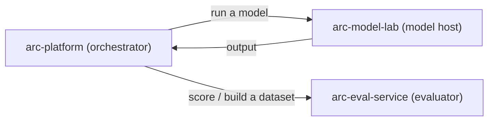
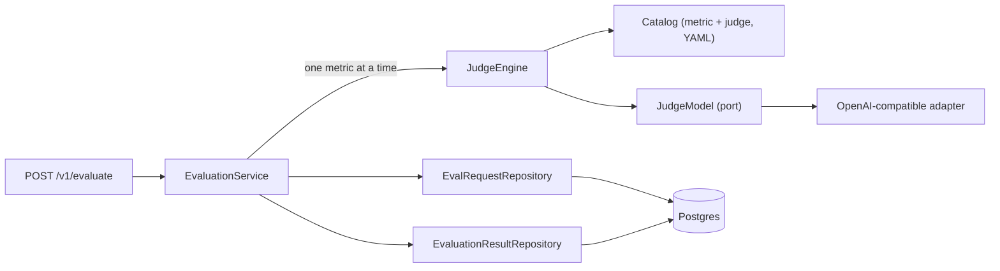
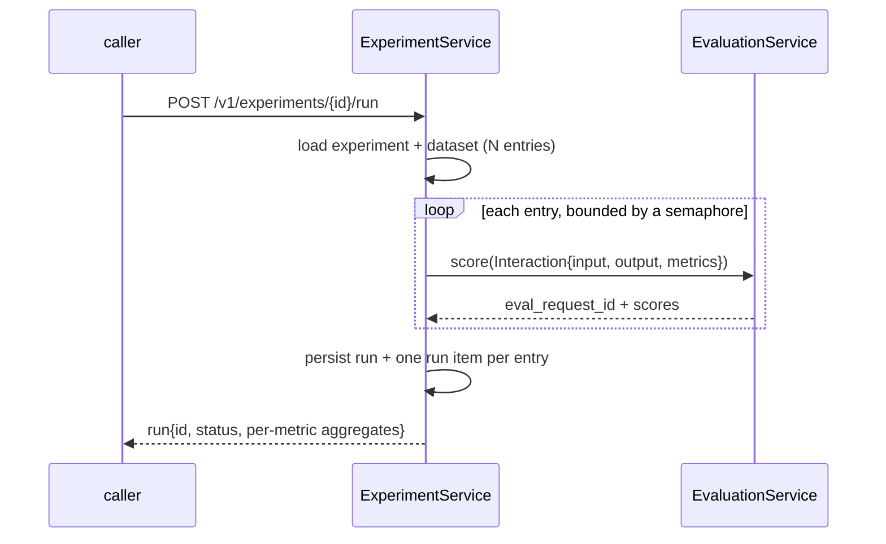

# Service: arc-eval-service

Audience: backend engineers. Reading time: 6 minutes.

## Role

Score completed AI interactions and return a quality score per metric. The service
owns the metrics, their rubrics, the judges, and the judge-model calls. Metric and
judge prompts live in a YAML library, not in code. It runs no inference, calls no
other service, and does not decide what a caller does with the scores.

It offers two surfaces over one scoring core:

- **Evaluate**: score one supplied interaction now.
- **Experiments**: score a stored dataset of interactions against a fixed metric
  set, and aggregate the results.

## Where it sits: no direct service-to-service call

The evaluator does not talk to arc-model-lab. The two services are decoupled;
arc-platform is the orchestrator that connects them.



arc-model-lab produces an output for an input. arc-platform collects that finished
interaction and either scores it directly (`POST /v1/evaluate`) or adds it to an
experiment's dataset to score in bulk later. The evaluator only ever receives
completed interactions as data; it never fetches or generates one.

## Scoring flow (evaluate)



The route builds an `Interaction` (input, output, metrics) from the request and
hands it to the scoring core. There is no request resolution and no lab call: the
interaction arrives complete.

1. `EvaluationService` validates the metrics the request names against the catalog.
   An unknown metric name is rejected with `404` before any scoring.
2. It scores them concurrently through `JudgeEngine`, one metric at a time, each run
   on the resolved judge model requesting a structured `Verdict` response.
3. It persists the request and every result, then returns the metrics that scored.

## Experiments: scoring a dataset

An experiment is a named, reusable evaluation: a metric set plus a dataset of
completed interactions. A dataset entry is `{input_text, output_text, system_text?}`,
an output produced elsewhere. A run scores every entry against the experiment's
metrics and rolls the scores up per metric.



A run **reuses the evaluate scoring core**, once per dataset entry, so there is one
scoring path, not two. The judge fan-out is bounded by a semaphore, because an
unbounded fan-out over `N` entries times `M` metrics is an outage at scale. Each
scored entry links to its `eval_requests` row through a run item, which is what lets
aggregation join back to `evaluation_results`.

The contract:

| Endpoint | Body | Returns |
| --- | --- | --- |
| `POST /v1/experiments` | `{name, description?, metrics, dataset?}` | the experiment + `dataset_size` |
| `POST /v1/experiments/{id}/dataset` | `{entries: [{input_text, output_text, system_text?}]}` | `{experiment_id, added, dataset_size}` |
| `GET /v1/experiments/{id}/dataset` | | the entries in position order |
| `POST /v1/experiments/{id}/run` | (empty) | `{run_id, status, dataset_size, scored_count, results}` |
| `GET /v1/experiments/{id}/results` | | latest-run per-metric aggregates |
| `GET /v1/experiments/{id}/compare/{other}` | | both experiments' aggregates |

`metrics` is validated against the catalog at **creation** (a misnamed metric is a
`404` there, not at run time). Running an experiment with an empty dataset is a
`409`. `results` and `compare` report the **latest** run's aggregates.

## Metric selection

The caller names the metrics on every request; an experiment fixes them once. There
is no server-side task classification: the service scores exactly the metrics it is
given, and an unknown metric name is rejected with `404` before any scoring or
persistence.

## Metrics and judges

Metric and judge definitions live in per-file YAML under
[catalog/metric/](../src/arc_eval_service/catalog/metric) and
[catalog/judge/](../src/arc_eval_service/catalog/judge), one file per metric or
judge, loaded and validated once at startup (a malformed file fails boot, not a
request). The engine composes the system prompt as an ordered pipeline:

```text
system = [judge.system_prompt?] + metric.rubric
user   = render(metric.template, case)
```

A judge with no system prompt of its own runs the metric rubric only; a judge with
one has it prepended. The output contract is not a prompt: the engine requests a
structured [Verdict](../src/arc_eval_service/judging/verdict.py) through the model's
JSON-schema mode, so the JSON shape cannot drift from the parser. Adding a metric or
a judge, or tuning a rubric, is a YAML edit; the code does not change.

## Judge models

A judge names a `model_profile`; the profile is the transport and credentials
(provider, model id, optional `base_url`, and the env var holding the API key).
Secrets resolve at call time, never stored in a profile, a judge, a request, or a
log. Models are pluggable through the `JudgeModel` port: one OpenAI-compatible
adapter covers OpenAI, Azure OpenAI, and self-hosted servers (vLLM, Ollama) by
changing `base_url`. Adding a vendor is a new adapter under
[judging/providers](../src/arc_eval_service/judging/providers); nothing else changes.

## Failure handling

| Condition | Behavior |
| --- | --- |
| One metric fails to score (bad verdict, model error) | That metric is persisted with its error and omitted from the response. Other metrics are unaffected. |
| No judge model configured | Every metric errors. The response is `{"results": []}`; the errored rows are still persisted. |
| The observability write fails | Logged and swallowed. The caller still receives its scores. |
| Required request field missing, or an unknown field sent | `422`, before any scoring. |
| A named metric is not in the catalog | `404`, before any scoring or persistence. |
| An experiment run against an empty dataset | `409`. |

Scoring never fails the request: the judge engine degrades a failed metric to an
errored result rather than raising. Persistence is the caller's bookkeeping, not
their availability, so it never fails the response.

## What it does not own

Inference, model hosting, routing, guardrails, the generation config that produced
an output, or the roll-up of many metrics into a single verdict. It reports and
stores per-metric scores over supplied interactions; the caller decides what they
mean. Model attribution (which model produced an output) lives with the orchestrator
that ran it, not here.
