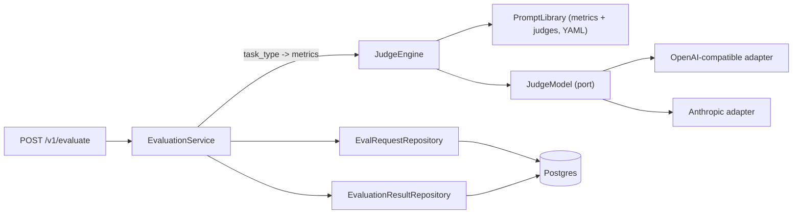

# Service: arc-eval-service

Audience: backend engineers. Reading time: 4 minutes.

## Role

Score one completed AI interaction and return a quality score per metric. Scoring
is synchronous on the request, best effort, and LLM-as-a-judge. The service owns
the metrics, their rubrics, the judges, and the judge-model calls. Metric and
judge prompts live in a YAML library, not in code. It does not run inference,
route requests, or decide a caller's response.

The wire contract is in the [README](../README.md). This document is the internal
design.

## Scoring flow



1. `EvaluationService` picks the metrics for the request's `task_type`.
2. It scores them concurrently through `JudgeEngine`, one metric at a time,
   each rendered to a strict-JSON verdict prompt and run on the resolved model.
3. It persists the request and every result, then returns the metrics that scored.

A **metric** is a criterion (a rubric, the case fields it needs, a case-layout
template, and a threshold). A **judge** is prompt scaffolding (an optional system
prompt plus sampling settings) bound to a model profile. Both are data, loaded
from per-file YAML. The engine composes them; the model call and verdict parsing
are its only logic. Add or edit a metric or judge by editing YAML, not code.

## task_type to metrics

The mapping is a small in-code table in
[service.py](../src/arc_eval_service/evaluation/service.py), because it is scoring
policy, not configuration.

| task_type | metrics |
| --- | --- |
| `summarization` | `faithfulness`, `answer_relevance` |
| (any other) | `answer_relevance`, `safety` |

## Prompts and judges

Metric and judge prompts live in per-file YAML under
[prompts/metrics/](../src/arc_eval_service/prompts/metrics) and
[prompts/judges/](../src/arc_eval_service/prompts/judges), one file per metric or
judge, loaded and validated once at startup (a malformed file fails boot, not a
request). The engine
composes the system prompt as an ordered pipeline of optional layers:

```text
system = [judge.system_prompt?] + metric.rubric + verdict instruction
user   = render(metric.template, case)
```

A judge with no system prompt of its own runs the metric rubric only; a judge with
one has it prepended. The verdict instruction (the JSON output contract) is always
last and lives in code next to the parser, so it cannot drift from
[parse_verdict](../src/arc_eval_service/judging/verdict.py). Adding a metric or a
judge, or tuning a rubric, is a YAML edit; the code does not change.

## Judge models

A judge in the library names a `model_profile`; the profile is the transport and
credentials (provider, model id, optional `base_url`, and the env var holding the
API key). Secrets resolve at call time, never stored in a profile, a judge, a
request, or a log. Models are pluggable through the `JudgeModel` port: one
OpenAI-compatible adapter covers OpenAI, Azure OpenAI, and self-hosted servers
(vLLM, Ollama) by changing `base_url`. Adding a vendor is a new adapter under
[judging/providers](../src/arc_eval_service/judging/providers); nothing else
changes.

## Failure handling

| Condition | Behavior |
| --- | --- |
| One metric fails to score (bad verdict, model error) | That metric is persisted with its error and omitted from the response. Other metrics are unaffected. |
| No judge model configured | Every metric errors. The response is `{"results": []}`; the errored rows are still persisted. |
| The observability write fails | Logged and swallowed. The caller still receives its scores. |
| Required request field missing | `422`, before any scoring. |

Scoring never fails the request: the judge engine degrades a failed metric to an
errored result rather than raising. Persistence is the caller's bookkeeping, not
their availability, so it never fails the response.

## What it does not own

Inference, routing, guardrails, dataset curation, or the roll-up of many metrics
into a single verdict. It reports and stores per-metric scores; the caller decides
what they mean.
