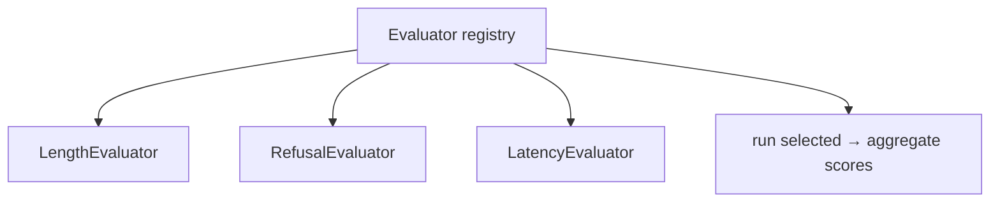

# Service — arc-evaluator

**Role:** measure response quality. Online (inline, best-effort) in Phase 1;
offline (off the span store) deferred. The split is
[ADR-0008](../adr/0008-online-offline-evaluation.md).

For Phase 1: **heuristic, deterministic evaluators only** — no judge models, no
benchmark orchestration, no synthetic datasets (YAGNI).

---

## API

```
POST /v1/evaluate    # score a completed request, inline
GET  /health
```

```jsonc
// request
{ "request": {...}, "response": {...}, "tenant": "acme" }

// response
{ "scores": { "length": 0.8, "refusal": 0.0 }, "passed": true }
```

---

## Internal design — strategy + registry



- Each **evaluator is a pure function**: `(request, response) -> Score`. No I/O.
- The **registry** maps a name to a function; the active set is config-driven.
  Adding a metric = write a pure function, register it.
- The **same pure evaluators** are reused by the offline shell later, so we never
  write a metric twice (DRY across online/offline).

```
arc_evaluator/
  evaluators/     # pure scoring functions (functional core)
  registry.py     # name → evaluator
  api/            # FastAPI routes (shell)
  config.py       # active evaluators, thresholds
  main.py
```

Scores are emitted as `arc.eval.*` span attributes, landing in the
[evaluation table](../data/database-schema.md).

---

## Constraints

Online evaluation is on the hot path, so it is **strictly bounded**:

- in-memory only, no network, no model calls
- sub-100ms budget (see [timeouts](../architecture/request-lifecycle.md#4-timeouts-and-budgets))
- **best-effort**: any error or timeout degrades gracefully — a request is never
  failed because scoring failed

---

## Testing

- **Unit:** each evaluator over example pairs with known expected scores.
- **Aggregation:** pass/fail-against-threshold logic.
- **Budget:** a guard test asserting evaluators stay within the time budget.

## What it does **not** own
Judge models (deferred), datasets, storage, orchestration. It reports scores; it
does not decide the response.
