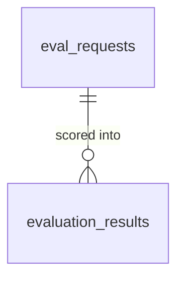

# Database: arc-eval-service

Audience: backend engineers. Reading time: 4 minutes.

The service owns two tables. `eval_requests` holds one interaction submitted for
evaluation; `evaluation_results` holds one metric score per row against it. Both
are written on every `POST /v1/evaluate` call. The schema is managed by Alembic
(`migrations/`).

## ERD



## DDL

```sql
CREATE TABLE eval_requests (
    id                text PRIMARY KEY,
    input_text        text NOT NULL,
    output_text       text NOT NULL,
    prompt            text,
    inference_id      text,                 -- caller correlation, from metadata
    model_id          text,                 -- model under test, from metadata
    request_metadata  jsonb NOT NULL,
    created_at        timestamptz NOT NULL DEFAULT now()
);
CREATE INDEX ix_eval_requests_inference_id ON eval_requests (inference_id);
CREATE INDEX ix_eval_requests_created_at   ON eval_requests (created_at);
```

```sql
CREATE TABLE evaluation_results (
    id                 text PRIMARY KEY,
    eval_request_id    text NOT NULL REFERENCES eval_requests (id) ON DELETE CASCADE,
    inference_id       text,               -- denormalized from the request
    model_id           text,               -- denormalized from the request
    metric_name        text NOT NULL,
    score              double precision NOT NULL,
    passed             boolean NOT NULL,
    reasoning          text,
    evaluator_name     text NOT NULL,
    evaluator_version  text,
    judge              jsonb,              -- judge model, settings, system prompt
    prompt             jsonb,              -- metric template + input variables
    latency_ms         double precision NOT NULL,
    error              text,               -- set when the metric failed to score
    created_at         timestamptz NOT NULL DEFAULT now()
);
CREATE INDEX ix_evaluation_results_eval_request_id ON evaluation_results (eval_request_id);
CREATE INDEX ix_evaluation_results_inference_id    ON evaluation_results (inference_id);
CREATE INDEX ix_evaluation_results_metric_name     ON evaluation_results (metric_name);
CREATE INDEX ix_evaluation_results_created_at      ON evaluation_results (created_at);
```

One metric per row (not a JSON blob) keeps the primary query paths indexable:
filter by metric, group by model, or window by time without unpacking JSON.
`inference_id` and `model_id` are denormalized onto `evaluation_results` so the
common queries need no join. The table is append-only: a re-evaluation writes a
new request and new rows, so retries stay visible rather than overwriting history.

## Provenance: judge and prompt

`judge` and `prompt` are JSONB, not foreign keys to `judges` or `prompt_templates`
tables. This is deliberate for the initial rollout.

- `judge`: the judge name and version, the resolved model and provider, the
  sampling settings, and the exact system prompt the judge received. Enough to
  reproduce the call.
- `prompt`: the metric rubric (`template`) and the input variables it was rendered
  with (`variables`).

Denormalized (JSONB), not normalized (foreign keys), because:

- `evaluation_results` is an append-only audit log. Each row must stay a faithful
  record of how that score was produced. A foreign key to a mutable `judges` or
  `prompt_templates` row would let a later edit change the meaning of a historical
  score.
- Metrics and judges live in a YAML catalog (`catalog/`), not a database
  registry. A normalized table would have no second reader or writer yet.
- Write volume is low; duplicating a small rubric string per row costs little.
- JSONB lets the shape evolve (add `top_p`, `seed`, few-shot examples) without a
  migration.

The input variables are stored as one JSONB object, not an entity-attribute-value
child table. EAV is an anti-pattern for the handful of structured, known fields a
metric uses.

Normalize later, when metrics and judges become first-class editable entities (a
registry with versions, A/B tests, per-template dashboards): extract
`prompt_templates` and `judges`, reference them by id, and backfill.
`evaluator_version` already gives a stable grouping key in the meantime.

## Observability queries

These run against the tables directly, no metrics system required.

```sql
-- Average score per metric (successful scores only).
SELECT metric_name, avg(score) AS mean_score, count(*) AS n
FROM evaluation_results
WHERE error IS NULL
GROUP BY metric_name;

-- Average score per judge and per resolved model (lifted from the judge JSONB).
SELECT judge ->> 'name' AS judge, judge ->> 'model' AS model, avg(score) AS mean_score
FROM evaluation_results
WHERE error IS NULL
GROUP BY judge ->> 'name', judge ->> 'model';

-- Failure rate per metric.
SELECT metric_name,
       avg((error IS NOT NULL)::int)::numeric(5, 4) AS failure_rate
FROM evaluation_results
GROUP BY metric_name;

-- Score per model under test, for model comparison.
SELECT model_id, metric_name, avg(score) AS mean_score
FROM evaluation_results
WHERE error IS NULL
GROUP BY model_id, metric_name;

-- Judge latency per metric.
SELECT metric_name, avg(latency_ms) AS mean_ms
FROM evaluation_results
GROUP BY metric_name;
```
