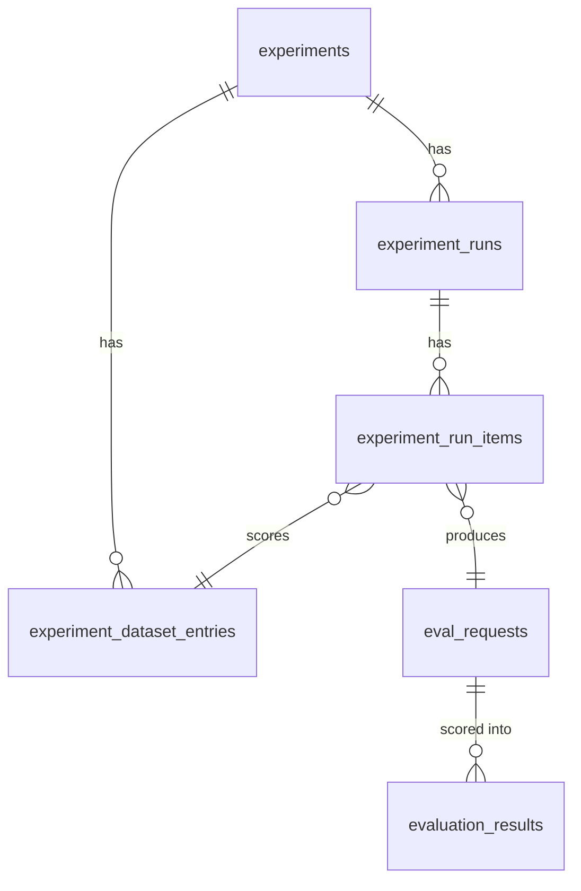

# Database: arc-eval-service

Audience: backend engineers. Reading time: 6 minutes.

The service owns six tables. Two hold scoring (`eval_requests`,
`evaluation_results`), written on every scored interaction. Four hold experiments
(`experiments`, `experiment_dataset_entries`, `experiment_runs`,
`experiment_run_items`). The schema is managed by Alembic (`migrations/`) and
mirrored by the SQLAlchemy ORM in `src/arc_eval_service/db/models.py`.

## ERD



## Scoring tables

Written on every scored interaction, whether a standalone `POST /v1/evaluate` or one
entry of an experiment run.

```sql
CREATE TABLE eval_requests (
    id                text PRIMARY KEY,
    input_text        text NOT NULL,
    output_text       text NOT NULL,
    prompt            text,                 -- unused by the evaluator (retained, see note)
    inference_id      text,                 -- unused (retained, see note)
    model_id          text,                 -- unused (retained, see note)
    request_metadata  jsonb NOT NULL,       -- empty for standalone evaluate
    created_at        timestamptz NOT NULL DEFAULT now()
);
CREATE INDEX ix_eval_requests_inference_id ON eval_requests (inference_id);
CREATE INDEX ix_eval_requests_created_at   ON eval_requests (created_at);
```

```sql
CREATE TABLE evaluation_results (
    id                 text PRIMARY KEY,
    eval_request_id    text NOT NULL REFERENCES eval_requests (id) ON DELETE CASCADE,
    inference_id       text,               -- unused (retained, see note)
    model_id           text,               -- unused (retained, see note)
    metric_name        text NOT NULL,
    score              double precision NOT NULL,
    passed             boolean NOT NULL,
    reasoning          text,
    evaluator_name     text NOT NULL,
    evaluator_version  text,
    judge              jsonb,              -- judge model, settings, system prompt
    prompt             jsonb,              -- metric template + input variables
    latency_ms         double precision NOT NULL,
    error              text,               -- set when the metric failed to score
    created_at         timestamptz NOT NULL DEFAULT now()
);
CREATE INDEX ix_evaluation_results_eval_request_id ON evaluation_results (eval_request_id);
CREATE INDEX ix_evaluation_results_inference_id    ON evaluation_results (inference_id);
CREATE INDEX ix_evaluation_results_metric_name     ON evaluation_results (metric_name);
CREATE INDEX ix_evaluation_results_created_at      ON evaluation_results (created_at);
```

One metric per row (not a JSON blob) keeps the primary query paths (by metric, over
time) indexable in plain SQL. The tables are append-only: a re-evaluation writes a
new request and new rows, so history is preserved rather than overwritten.

> **Note on `inference_id`, `model_id`, `prompt`.** The evaluator scores supplied
> text and carries no model attribution, so these columns are written null (and
> `request_metadata` empty). They remain for the browse surface (`GET /v1/results`
> still exposes a `model_id` filter) and will be dropped in a later migration once
> nothing reads them. The `?model_id=` filter therefore returns nothing today.

## Experiment tables

An experiment is a metric set plus a dataset of completed interactions. A run scores
the dataset and links each scored entry back to the `eval_requests` row that holds
its scores.

```sql
CREATE TABLE experiments (
    id           text PRIMARY KEY,
    name         text NOT NULL,
    metrics      jsonb NOT NULL DEFAULT '[]'::jsonb,   -- the metric names to score against
    description  text,
    created_at   timestamptz NOT NULL DEFAULT now(),
    CONSTRAINT uq_experiments_name UNIQUE (name)
);
CREATE INDEX ix_experiments_created_at ON experiments (created_at);
```

```sql
CREATE TABLE experiment_dataset_entries (
    id             text PRIMARY KEY,
    experiment_id  text NOT NULL REFERENCES experiments (id) ON DELETE CASCADE,
    position       integer NOT NULL,      -- dense, append order, for stable listing
    input_text     text NOT NULL,
    system_text    text,                  -- optional; stored, not scored (see note)
    output_text    text NOT NULL,
    created_at     timestamptz NOT NULL DEFAULT now()
);
CREATE INDEX ix_experiment_dataset_entries_experiment_id ON experiment_dataset_entries (experiment_id);
```

```sql
CREATE TABLE experiment_runs (
    id             text PRIMARY KEY,
    experiment_id  text NOT NULL REFERENCES experiments (id) ON DELETE CASCADE,
    status         text NOT NULL DEFAULT 'completed',  -- seam for background runs later
    created_at     timestamptz NOT NULL DEFAULT now()
);
CREATE INDEX ix_experiment_runs_experiment_id ON experiment_runs (experiment_id);
CREATE INDEX ix_experiment_runs_created_at    ON experiment_runs (created_at);
```

```sql
CREATE TABLE experiment_run_items (
    id                text PRIMARY KEY,
    run_id            text NOT NULL REFERENCES experiment_runs (id) ON DELETE CASCADE,
    dataset_entry_id  text NOT NULL REFERENCES experiment_dataset_entries (id) ON DELETE CASCADE,
    eval_request_id   text REFERENCES eval_requests (id) ON DELETE SET NULL,
    created_at        timestamptz NOT NULL DEFAULT now()
);
CREATE INDEX ix_experiment_run_items_run_id ON experiment_run_items (run_id);
```

A run item is the link that lets aggregation reuse the scoring tables: it ties one
dataset entry, scored in one run, to the `eval_requests` row (and thus the
`evaluation_results` rows) that hold its metric scores.

> **Note on `system_text`.** A dataset entry records the system prompt that produced
> the output for fidelity, but no current metric reads it (metrics score `input`
> against `output`). It is stored and exposed on reads, and wired into a metric only
> when one needs it.

## Aggregating an experiment's scores

`results` and `compare` report the **latest** run. The query resolves the
experiment's most recent `experiment_runs` row, then averages the
`evaluation_results` its run items point at, filtering `error IS NULL` so a failed
metric is not averaged in as a real zero:

```sql
SELECT er.metric_name,
       avg(er.score)  AS average_score,
       count(*)       AS evaluated_count
FROM evaluation_results er
JOIN experiment_run_items ri ON ri.eval_request_id = er.eval_request_id
WHERE ri.run_id = (
        SELECT id FROM experiment_runs
        WHERE experiment_id = :experiment_id
        ORDER BY created_at DESC
        LIMIT 1
      )
  AND er.error IS NULL
GROUP BY er.metric_name;
```

One indexed join path, no N+1. Re-running an experiment writes a new run and new run
items; only the latest run is reported, so re-runs never double-count.

## Provenance: judge and prompt

`judge` and `prompt` on `evaluation_results` are JSONB, not foreign keys to `judges`
or `prompt_templates` tables. This is deliberate.

- `judge`: the judge name and version, the resolved model and provider, the sampling
  settings, and the exact system prompt the judge received. Enough to reproduce the
  call.
- `prompt`: the metric rubric (`template`) and the input variables it was rendered
  with (`variables`).

Denormalized (JSONB), not normalized (foreign keys), because `evaluation_results` is
an append-only audit log: each row must stay a faithful record of how that score was
produced. A foreign key to a mutable `judges` or `prompt_templates` row would let a
later edit change the meaning of a historical score. Metrics and judges live in a
YAML catalog (`catalog/`), not a database registry, so a normalized table would have
no second reader yet, and JSONB lets the shape evolve (add `top_p`, `seed`, few-shot
examples) without a migration. Normalize later, when metrics and judges become
first-class editable entities; `evaluator_version` gives a stable grouping key in
the meantime.

## Observability queries

These run against the tables directly, no metrics system required.

```sql
-- Average score per metric (successful scores only).
SELECT metric_name, avg(score) AS mean_score, count(*) AS n
FROM evaluation_results
WHERE error IS NULL
GROUP BY metric_name;

-- Average score per judge and per resolved judge model (from the judge JSONB).
SELECT judge ->> 'name' AS judge, judge ->> 'model' AS model, avg(score) AS mean_score
FROM evaluation_results
WHERE error IS NULL
GROUP BY judge ->> 'name', judge ->> 'model';

-- Failure rate per metric.
SELECT metric_name,
       avg((error IS NOT NULL)::int)::numeric(5, 4) AS failure_rate
FROM evaluation_results
GROUP BY metric_name;

-- Judge latency per metric.
SELECT metric_name, avg(latency_ms) AS mean_ms
FROM evaluation_results
GROUP BY metric_name;
```
