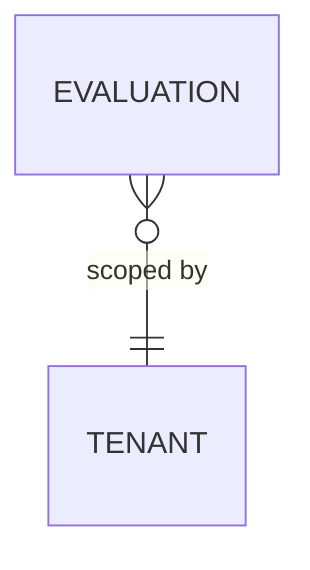

# Database — arc-evaluator

The evaluator owns its DB: one row per judge that scored a response, online or
offline. Judge models are pluggable ([ADR-0011](0011-pluggable-models.md)) and
not stored here.

## ERD



## DDL

```sql
CREATE TABLE evaluation (
    id          bigint GENERATED ALWAYS AS IDENTITY PRIMARY KEY,
    span_id     text NOT NULL,
    trace_id    text NOT NULL,
    evaluator   text NOT NULL,        -- faithfulness | relevance | safety
    score       numeric,
    passed      boolean,
    threshold   numeric,
    metadata    jsonb NOT NULL DEFAULT '{}'::jsonb,
    tenant_id   text NOT NULL,
    created_at  timestamptz NOT NULL DEFAULT now(),
    UNIQUE (span_id, evaluator)
);
CREATE INDEX evaluation_eval_idx ON evaluation (evaluator, created_at DESC);
```

Scores are also emitted as `arc.eval.*` span attributes for the trace store; this
DB is the queryable record. Online/offline split: [ADR-0008](0008-online-offline-evaluation.md).
