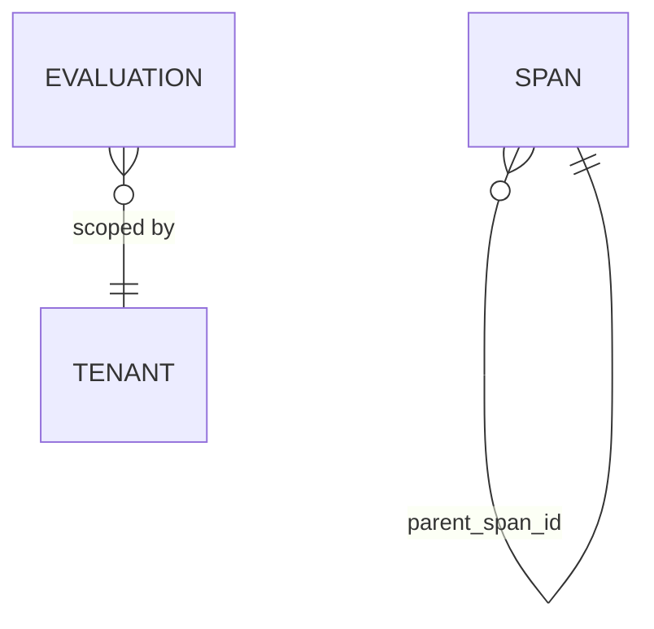

# Database — arc-evaluator

The evaluator owns one database with two concerns: **evaluation results** (one
row per judge that scored a response, online or offline) and the **span/trace
store** that backs trace inspection (ADR-0006). Judge models are pluggable
([ADR-0011](0011-pluggable-models.md)) and not stored here.

## ERD



## DDL

```sql
CREATE TABLE evaluation (
    id          bigint GENERATED ALWAYS AS IDENTITY PRIMARY KEY,
    span_id     text NOT NULL,
    trace_id    text NOT NULL,
    evaluator   text NOT NULL,        -- faithfulness | relevance | safety
    score       numeric,
    passed      boolean,
    threshold   numeric,
    metadata    jsonb NOT NULL DEFAULT '{}'::jsonb,
    tenant_id   text NOT NULL,
    created_at  timestamptz NOT NULL DEFAULT now(),
    UNIQUE (span_id, evaluator)
);
CREATE INDEX evaluation_eval_idx ON evaluation (evaluator, created_at DESC);
```

The **span store** holds the normalised spans the collector fans in. Keyed on
`span_id` for idempotent upserts (the collector may redeliver, and children may
arrive before parents); `trace_id` is indexed because reads fetch a whole trace.
The trace tree served at `GET /v1/traces/{trace_id}` is assembled from these rows
on read (offsets relative to the earliest span), so there is no separate trace
table.

```sql
CREATE TABLE spans (
    span_id         text PRIMARY KEY,
    trace_id        text NOT NULL,
    parent_span_id  text,
    name            text NOT NULL,
    service_name    text,
    kind            text,
    start_unix_nano bigint NOT NULL,
    end_unix_nano   bigint NOT NULL,
    attributes      jsonb NOT NULL DEFAULT '{}'::jsonb,   -- flattened arc.* keys
    ingested_at     timestamptz NOT NULL DEFAULT now()
);
CREATE INDEX ix_spans_trace_id     ON spans (trace_id);
CREATE INDEX ix_spans_service_name ON spans (service_name);
CREATE INDEX ix_spans_ingested_at  ON spans (ingested_at);
```

Scores are also emitted as `arc.eval.*` span attributes (stored on the matching
span rows); the `evaluation` table is the queryable record of verdicts.
Online/offline split: [ADR-0008](0008-online-offline-evaluation.md).
