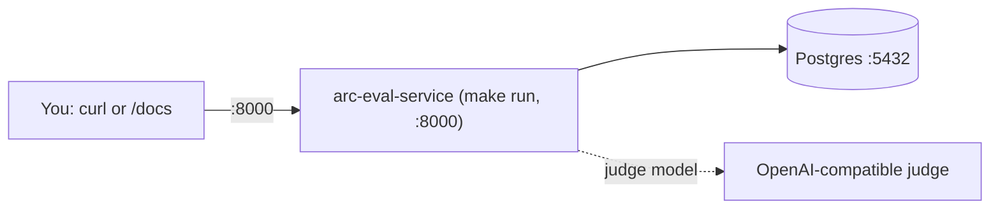

# End-to-end testing: evaluation and experiments

Audience: engineers validating the service locally. Reading time: 10 minutes.

This is a copy-paste walkthrough of the two surfaces, both against
`arc-eval-service` alone:

- **Part A** scores one completed interaction.
- **Part B** runs an experiment: score a dataset of interactions against a fixed
  metric set and read the aggregates back.

The evaluator scores text it is given, so neither part calls another service. To
score real model outputs, produce them with arc-model-lab (or arc-platform) first
and paste the outputs in as data; the evaluator only needs the finished
interactions.

Every request body is shown as a JSON block you can paste straight into the
interactive docs (`/docs` -> pick the endpoint -> **Try it out** -> **Request
body** -> **Execute**), followed by the equivalent `curl`.

## What you will run

One service and its database, plus a judge model:



## Prerequisites

- macOS or Linux, with [`uv`](https://docs.astral.sh/uv/), Docker + Docker Compose,
  `curl`, and [`jq`](https://jqlang.github.io/jq/).
- This repository checked out.
- A judge model to score with: an API key for an OpenAI-compatible provider, or a
  local server (Ollama, vLLM). Without one, scoring still runs but every metric
  records a "no judge configured" error: evaluate returns `{"results": []}` and an
  experiment run returns empty aggregates.

Use two terminals: **Terminal A** runs the server and stays open; **Terminal B**
runs the test commands.

## Setup

In **Terminal B**, configure the service and prepare the database:

```bash
cp .env.example .env                          # first time only
```

Edit `.env` and set a real judge key so scoring returns real numbers. The template
ships a working profile that reads `OPENAI_API_KEY`:

```bash
ARC_EVAL_MODEL_PROFILES='[{"name":"default","provider":"openai_compatible","model":"gpt-4o-mini","api_key_env":"OPENAI_API_KEY"}]'
ARC_EVAL_DEFAULT_MODEL=default
OPENAI_API_KEY=sk-your-real-key
```

For a local, offline judge (Ollama, vLLM), add a `base_url` and use any non-empty
key, for example:

```bash
ARC_EVAL_MODEL_PROFILES='[{"name":"default","provider":"openai_compatible","model":"llama3.1","base_url":"http://localhost:11434/v1","api_key_env":"OPENAI_API_KEY"}]'
OPENAI_API_KEY=ollama
```

Bring up the database, apply the schema, and start the server:

```bash
docker compose up -d db                        # Postgres on :5432
uv sync                                         # create the venv
make migrate                                    # apply schema (loads .env)
```

In **Terminal A**, start the server and leave it running:

```bash
make run                                         # serves on http://localhost:8000
```

Back in **Terminal B**, confirm it is up:

```bash
curl -s localhost:8000/health | jq             # -> {"status":"ok","service":"arc-eval-service"}
```

## Reset to a fresh database

Use this whenever you want to wipe every request, result, experiment, dataset, and
run and start from an empty schema. The data lives in a Docker named volume; the
Makefile wraps the reset (stop any `make run` server first):

```bash
make db-reset    # docker compose down -v, then db up, then migrate
```

There is no model-weight cache here (this service calls a judge over HTTP), so the
reset only affects the database.

---

## Part A: score an interaction

### 1. List the available metrics

`GET /v1/metrics` returns the metrics you can score against (the bundled catalog).

```bash
curl -s localhost:8000/v1/metrics | jq
```

You should see `faithfulness`, `answer_relevance`, and `safety`.

### 2. Score an interaction

`POST /v1/evaluate` scores one completed interaction across the metrics you name,
persists the request and every result, and returns the metrics that scored. The body
is exactly the input, the output, and the metrics.

Request body:

```json
{
  "input_text": "The Eiffel Tower is a wrought-iron lattice tower on the Champ de Mars in Paris, France. It was built for the 1889 World Exposition.",
  "output_text": "The Eiffel Tower is an iron tower in Paris, built for the 1889 World Exposition.",
  "metrics": ["faithfulness", "answer_relevance"]
}
```

```bash
curl -s localhost:8000/v1/evaluate \
  -H 'content-type: application/json' \
  -d '{
    "input_text": "The Eiffel Tower is a wrought-iron lattice tower on the Champ de Mars in Paris, France. It was built for the 1889 World Exposition.",
    "output_text": "The Eiffel Tower is an iron tower in Paris, built for the 1889 World Exposition.",
    "metrics": ["faithfulness", "answer_relevance"]
  }' | jq
```

With a judge configured, the response scores each metric:

```json
{
  "contract_version": "1.0.0",
  "results": [
    {
      "metric_name": "faithfulness",
      "score": 0.95,
      "reasoning": "Every claim in the summary is supported by the source text.",
      "evaluator_name": "faithfulness",
      "evaluator_version": "v1"
    }
  ]
}
```

Without a judge, the request still succeeds and returns
`{"contract_version":"1.0.0","results":[]}`; the errored metrics are persisted for
observability. `/v1/evaluate` never fails on a scoring problem. Sending any field
other than `input_text`, `output_text`, and `metrics` (or an empty `metrics`) is a
`422`; an unknown metric name is a `404`.

### 3. Read the persisted rows back

`/v1/evaluate` returns only the scores; read the stored request and results through
the browse endpoints:

```bash
curl -s "localhost:8000/v1/requests?limit=5" | jq          # recent interactions, newest first
REQUEST_ID=$(curl -s "localhost:8000/v1/requests?limit=1" | jq -r '.[0].id')
curl -s "localhost:8000/v1/requests/$REQUEST_ID" | jq      # the request plus every metric score
curl -s "localhost:8000/v1/results?metric=faithfulness&limit=10" | jq
```

### 4. Verify the rows in the database

```bash
docker compose exec db psql -U arc -d arc_eval -c \
  "SELECT metric_name, score, passed, left(coalesce(error,''), 30) AS error
     FROM evaluation_results ORDER BY created_at DESC LIMIT 10;"
```

With a judge you see real scores and an empty `error`; without one, `score` is `0`,
`passed` is `false`, and `error` explains why.

---

## Part B: run an experiment over a dataset

An experiment is a named metric set plus a dataset of completed interactions.
Running it scores every entry against the metrics and rolls the scores up per metric.
There is no inference here: the dataset carries the outputs, produced elsewhere.

### 1. Create an experiment with a dataset

`POST /v1/experiments`. Names are unique (a duplicate is `409`); an unknown metric is
rejected at creation with `404`. The dataset is optional here and can be added later.

Request body:

```json
{
  "name": "summarization-baseline",
  "description": "Summarization quality over a small dataset.",
  "metrics": ["faithfulness", "answer_relevance"],
  "dataset": [
    {
      "input_text": "The city council approved 20 miles of protected bike lanes over three years, funded by a state grant.",
      "output_text": "The council approved 20 miles of protected bike lanes, funded by a state grant."
    },
    {
      "input_text": "The museum extended its weekend hours for the summer to meet higher demand.",
      "system_text": "You are a precise summarizer.",
      "output_text": "The museum has longer weekend hours this summer."
    }
  ]
}
```

```bash
EXP_ID=$(curl -s localhost:8000/v1/experiments \
  -H 'content-type: application/json' \
  -d '{
    "name": "summarization-baseline",
    "description": "Summarization quality over a small dataset.",
    "metrics": ["faithfulness", "answer_relevance"],
    "dataset": [
      { "input_text": "The city council approved 20 miles of protected bike lanes over three years, funded by a state grant.", "output_text": "The council approved 20 miles of protected bike lanes, funded by a state grant." },
      { "input_text": "The museum extended its weekend hours for the summer to meet higher demand.", "system_text": "You are a precise summarizer.", "output_text": "The museum has longer weekend hours this summer." }
    ]
  }' | jq -r '.id')
echo "experiment id: $EXP_ID"
```

The response carries `metrics`, `dataset_size`, and the id.

### 2. Append more dataset entries

`POST /v1/experiments/{id}/dataset` appends entries after the current last position.

```bash
curl -s localhost:8000/v1/experiments/$EXP_ID/dataset \
  -H 'content-type: application/json' \
  -d '{
    "entries": [
      { "input_text": "The library launched a free e-book lending program for members.", "output_text": "The library now lends e-books to members for free." }
    ]
  }' | jq          # -> {"experiment_id": "...", "added": 1, "dataset_size": 3}
```

List the dataset in order:

```bash
curl -s localhost:8000/v1/experiments/$EXP_ID/dataset | jq
```

### 3. Run the experiment

`POST /v1/experiments/{id}/run` scores the experiment's metrics over its whole
dataset and returns per-metric aggregates. The body is empty. Running against an
empty dataset is a `409`.

```bash
curl -s -X POST localhost:8000/v1/experiments/$EXP_ID/run | jq
```

```json
{
  "run_id": "r1-...",
  "experiment_id": "3c4d5e6f-...",
  "status": "completed",
  "dataset_size": 3,
  "scored_count": 3,
  "results": [
    { "metric_name": "answer_relevance", "average_score": 0.9, "evaluated_count": 3 },
    { "metric_name": "faithfulness", "average_score": 0.88, "evaluated_count": 3 }
  ]
}
```

Each entry is scored through the same judge path as `/v1/evaluate`. A metric that
errors on an entry is left out of that metric's `evaluated_count`, never scored as a
real zero.

### 4. Read the results and compare experiments

`GET /v1/experiments/{id}/results` returns the latest run's aggregates. Create a
second experiment (steps 1 and 3) and compare the two:

```bash
curl -s localhost:8000/v1/experiments/$EXP_ID/results | jq
curl -s localhost:8000/v1/experiments/$EXP_ID/compare/$OTHER_ID | jq
```

### 5. Verify the rows in the database

A run writes one `experiment_runs` row and one `experiment_run_items` row per scored
entry; the scores live in `evaluation_results`, joined through the run item's
`eval_request_id`:

```bash
docker compose exec db psql -U arc -d arc_eval -c \
  "SELECT r.id AS run, count(ri.*) AS items
     FROM experiment_runs r
     LEFT JOIN experiment_run_items ri ON ri.run_id = r.id
    GROUP BY r.id ORDER BY r.created_at DESC LIMIT 5;"
```

## Troubleshooting

| Symptom | Cause | Fix |
| --- | --- | --- |
| `{"results": []}` or empty aggregates | No judge model configured | Set a real `ARC_EVAL_MODEL_PROFILES` and key in `.env` |
| `404` on create | An unknown metric name | Use a metric from `GET /v1/metrics` |
| `409` on create | Duplicate experiment name | Choose a unique name |
| `409` on run | The dataset is empty | Add entries before running |
| `422` on evaluate | An extra field, or empty `metrics` | Send only `input_text`, `output_text`, `metrics` |

## See also

- [arc-evaluator.md](arc-evaluator.md): the internal design and the full contract.
- [db-design.md](db-design.md): the schema and the aggregation query.
